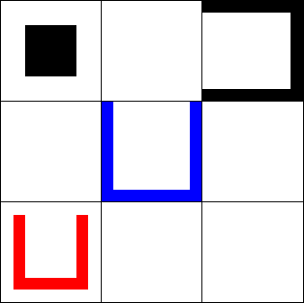

sliding-puzzle
==============

Consider a tray consisting of 3 rows and 3 columns and 4 movable pieces that are arranged in the tray as shown below:

Three of the pieces, called the shoes, are U-shaped, the remaining one, called the block, has the shape of a square. In a move, the block can be moved to a neighboring square (consider the squares that are to the left, right, top, or bottom). The block can not pass through the solid sides of the shoes, however, it can be moved inside them across their open side. When the block is inside a shoe they can move together: the block can push the shoe to the target square when their way is not blocked by another shoe on the target square. However, note that the red shoe can be moved inside one of the other two shoes. Thus, the block can move together with two shoes. The goal of the puzzle to move the red shoe inside the blue shoe.

The image below demonstrates how the block can move together with one or two shoes:

